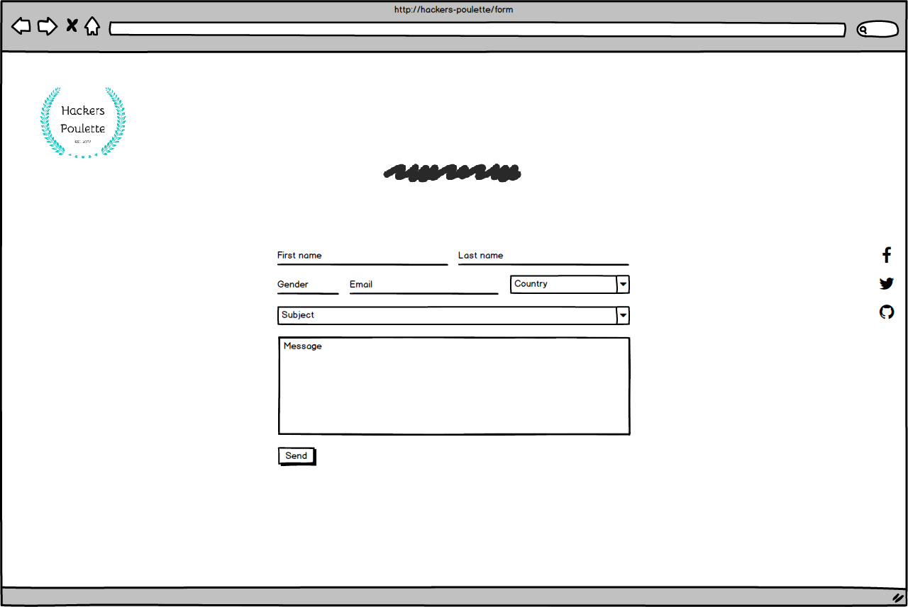
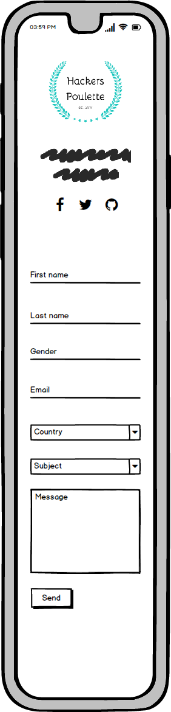
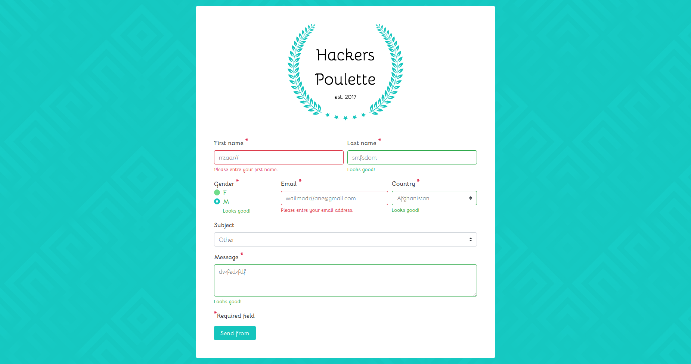

# Hackers Poulette

## The mission

The company Hackers Poulette ™ sells Raspberry Pi accessory kits to build yourself. They want to allow their users to contact their support team. Your mission is to develop a PHP script displaying a contact form and processing the received answer (sanitize, validate, answer the user).

